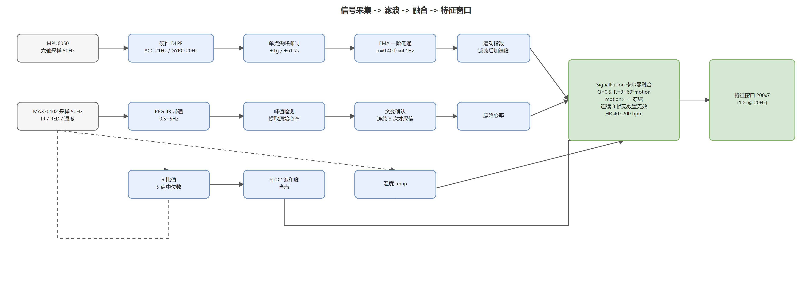
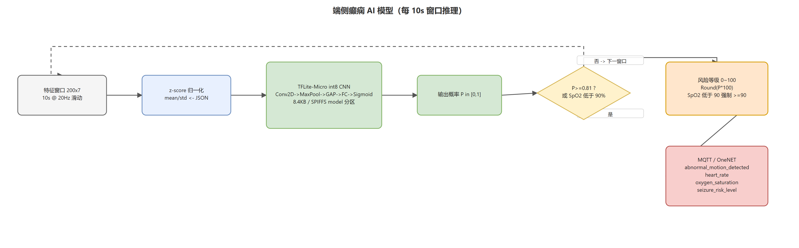

# ESP32S3癫痫前期症状监测手表
## 需求分析/项目背景
在如今，癫痫发病概率越来越高，在医院的神经外科大楼里可以看到每3个人就有一个人会发生脑卒中，也就是癫痫。所以做这个低成本的癫痫发病监测手表对低收入家庭十分重要，癫痫发病前期会心率异常，手部可能会伴随抽搐。我们想要开发一款能监测病人状况，发病的时候报警的手表，这个报警不只是本地蜂鸣器报警，还有发送到云端，同时既然他是手表，那就需要有一个屏幕显示内容：时间，手表剩余电量，wifi连接状态，心率血氧数值。 结合这些症状表现和我们的目的，为后续的选型提供来源。
## 硬件选型
### 1.	MCU：esp32s3n16r8。需要使用wifi去联网然后使用mqtt协议发送到onenet平台报警；而且心率血氧的计算和mpu6050判断是否摔倒需要一定的算力；同时还需要存储onenet平台信息、wifi凭证、ap配网的应用层html网页端代码等；还需要有足够的外设，还能为后续扩展功能提供平台0。所以选用了esp32s3n16r8这款带wifi和蓝牙的mcu。
### 2.	外设
#### （1）	心率血氧：max30102。在监测心率血氧这块，综合考虑准确度、成本、大小，选择光学传感器获得心率和血氧。
#### （2）	是否摔倒和手部抽搐：mpu6050。是否摔倒用加速度计判断，手部抽搐使用陀螺仪判断，mpu6050正好是六轴加速度陀螺仪的传感器，而且成本比较低，所以选用它。
#### （3）	蜂鸣器：选用有源蜂鸣器，因为它不需要为它提供一个震荡源，给他电压即可，然后通过三极管控制开关。
#### （4）	屏幕：中景园电子0.96寸OLED，尺寸不大，所能显示内容多少满足了我们的需求，而且成本低，而且项目要求的刷新率只需要1hz甚至更低，会比led屏幕省电。
其他硬件具体选型看原理图和pcb

## 项目所实现的
### 1.1	功能与特性
本项目实现了基于生物信号监测的癫痫前期预警系统，核心功能包括：
•	心率与血氧实时监测：采用MAX30102传感器，支持50Hz高采样率，通过算法实时计算心率值与血氧饱和度并上报（本地心率过快/过低预警已移除，异常判断交由端侧AI模型）
•	撞击/跌倒检测：基于MPU6050加速度计，以峰值幅值>2.0g 且活动变化>0.12 判定剧烈撞击，触发本地蜂鸣器与MQTT上报（抽搐检测已移除，避免日常活动误报）
•	端侧癫痫 AI 风险推理：SignalFusion 模块 10 秒滑动窗口采样 200×7 特征，端侧 int8 量化 CNN 模型输出 0~100 级发作风险，高风险（概率≥0.81 或 SpO₂<90%）时本地蜂鸣器报警，每 10 秒上报 OneNET
•	三级信号滤波链路：PPG 0.5-5Hz 带通 + MPU6050 尖峰抑制/EMA 低通 + 自适应卡尔曼心率融合，抑制运动伪迹
•	双重检测机制：主CPU与ULP协处理器协同工作，ULP持续监测触发条件，主CPU进行二次确认后触发报警
•	实时MQTT上报：异常数据通过MQTT协议实时上报至OneNET平台，支持手机和电脑远程查看，onenet平台端显示，手机上通过网站查看，然后再下面一张图就是开发出来的手机app显示数据

•	低功耗深度睡眠：连接wifi成功后，系统进入深度睡眠模式，ULP协处理器以超低功耗持续监测，检测到异常立即唤醒主CPU
•	多级报警系统：本地蜂鸣器报警（撞击/跌倒、端侧模型高风险）+ MQTT云端报警 + 手机远程查看三重保障
•	OLED实时显示：显示心率、血氧、电池电量、时间等信息，支持按键切换显示内容，如图

•	AP配网功能：长按Key2进入AP配网模式，支持动态配置WiFi和MQTT凭据，无需修改代码，如图

### 1.2	信号滤波与数据预处理
原始传感器信号含有运动伪迹、工频干扰与基线漂移，直接使用会造成心率/血氧误判、跌倒误报。本项目在信号进入算法判定与 AI 模型前做了三级信号处理：

**（1）MPU6050 六轴（50Hz）滤波链**

| 阶段 | 处理 | 参数 |
| ---- | ---- | ---- |
| ① 硬件低通 | MPU6050 内部 DLPF | 加速度 21Hz / 陀螺仪 20Hz，保留高频振动频段（2~30Hz） |
| ② 单点尖峰抑制 | 前后帧差分判单样本毛刺，替换为前一帧值 | 加速度 ±1g（2048 LSB）、陀螺仪 ±61°/s |
| ③ EMA 一阶低通 | 指数平滑导出值 | 平滑系数 α=0.40,截止约 4.1Hz @50Hz |

**(2) MAX30102 心率 / PPG 滤波链**

| 处理 | 说明 |
| ---- | ---- |
| PPG 带通滤波 | 0.5~5Hz 级联 IIR 高通+带低通，去除直流与工频干扰 |
| 峰值检测 | 带通后识别峰-峰间隔，得到原始心率 |
| 突变确认 | 连续 3 次异常跳变才采信，拒绝单点 180/190 假峰 |
| SpO₂ 提取 | 5 点 R 比值中位数查表，抗毛刺 |

**(3) SignalFusion 自适应卡尔曼心率融合**

| 参数 | 取值 | 作用 |
| ---- | ---- | ---- |
| 过程噪声 Q | 0.5 | 每帧不确定度 |
| 量测噪声 R | 9 + 60×motion | 静止信任量测，运动时放大噪声 |
| 运动冻结 | motion ≥ 1.0 | 强运动时冻结更新，防误跟踪 |
| 失效判定 | 连续 8 帧 | 无有效量测时输出无效 |
| 输出限幅 | 40~200 bpm | 钳位合法心率 |

融合后的心率与原始 IR/RED、温度、加速度共同构成模型 7 通道特征（见 1.3）。

### 1.3	端侧癫痫 AI 模型
在滤波与融合的基础上，端侧运行轻量 TFLite-Micro 卷积神经网络，直接用传感器信号评估癫痫发作风险，不上传原始波形，保护隐私的同时满足实时性。

**模型与部署**

- 模型：int8 量化 CNN（输入 Conv2D → MaxPool → 全局均值 → Dense → Sigmoid 输出），量化后仅 8.4KB
- 推理框架：TFLite-Micro（esp-tflite-micro 组件 v2.x）
- 存放位置：独立 `model` SPIFFS 分区（偏移 0xF00000，大小 1MB），文件 `model_int8.tflite`（8.4KB）+ 归一化参数 `model/normalization.json`

**特征与推理**

- 采样率 20Hz，10 秒滑动窗口 = 200×7 特征矩阵
- 特征通道：ax / ay / az、PPG_IR、PPG_RED、温度、卡尔曼融合心率
- 每 10 秒推理一次，输出发作概率 P∈[0,1]
- 阈值判据：P ≥ 0.81 判为高风险（SpO₂<90% 时强制提高风险分）；判定为高风险时同时触发本地蜂鸣器报警

**风险等级与上报**

- 风险分：seizure_risk_level = round(P×100)，取值范围 0~100；当 SpO₂ 低于 90% 时强制并提高到不低于 90（血氧过低为高危伴生信号）
- 模型结果经 SignalFusion → 消息队列 → MQTT 任务，一次上报 OneNET 物模型 4 个信息点：

| 信息点（JSON 字段） | 类型 | 说明 |
| ------------------ | ---- | ---- |
| abnormal_motion_detected | bool | 异常运动/跌倒标志 |
| heart_rate | number | 卡尔曼融合心率（bpm） |
| oxygen_saturation | number | 血氧饱和度（%） |
| seizure_risk_level | number | 癫痫发作风险等级 0~100 |

### 1.4	应用领域
该产品主要应用于以下场景：
•	癫痫患者日常监护：为癫痫患者提供实时发作前症状监测和预警，减少意外发生
•	老年人跌倒监测：利用加速度检测识别跌倒事件，及时通知家属或医疗机构
•	运动健康监测：监测心率异常和运动状态，适用于运动人群和健康管理
•	特殊人群看护：适用于需要长期监护的慢性病患者、老年人、残疾人士等
### 1.5	主要技术特点
1.	双核协同架构：ESP32-S3双核芯片，主CPU运行复杂算法，ULP协处理器运行低功耗监测程序，实现高性能与低功耗的平衡
2.	实时性保障：心率监测50Hz采样率，在主CPU中，跌倒检测阈值配置为加速度幅值 > 2.0g（即加速度平方和 > 4096² = 16,777,216 LSB²），响应时间约为 2.2 秒，在ulp中，考虑了多层因素（ulp的处理速度不够，防止频繁唤醒等），ulp中配置为加速度赋值>3.0g[10]
3.	低功耗设计：正常工作功耗<100mW，深度睡眠功耗<5μA，典型续航时间24小时以上
4.	高可靠性：采用二次确认机制，避免误报，主CPU被唤醒，拿到ulp获得的传感器数据再次计算，防止ulp运算不足造成误判；支持I2C挂死检测，系统稳定性高
5.	模块化设计：分层架构，BSP层处理硬件驱动，Middlewares层提供传感器和数据中间件，便于功能扩展
6.	端侧 AI 推理：int8 量化 CNN 模型在 ESP32-S3 上实时运行，10 秒窗口输出癫痫风险等级 0-100，模型存独立 SPIFFS 分区，OTA 不影响模型
### 1.6 手表视频演示查看我在b站发的视频
https://www.bilibili.com/video/BV1H3L96bEtP/?vd_source=c9924bda4031caf6f7caa15a01d9be91
### 1.7 产品图

内容新增：
1. ota升级
2. 开发的手机app可以查看心率血氧等数据
3. 端侧癫痫 AI 模型推理（10s 窗口、风险等级 0-100、OneNET 四信息点上报）
4. 三级信号滤波链（PPG 带通 + MPU6050 双级滤波 + 自适应卡尔曼心率融合）
5. 端侧模型高风险本地蜂鸣器报警联动

版本升级说明：

2.x版本：加入远程ota升级，开发的手机app查看数据

3.x版本：通过多级滤波提升准确度，加入端侧ai计算结果

3.1.x版本：传感器报警策略调整——移除MPU6050抽搐（持续抖动）检测，仅保留撞击/跌倒检测；移除MAX30102心率过快/过低预警与本地报警，保留心率/血氧计算并照常上报OneNET；端侧模型判定高风险（概率>0.81 或 SpO₂<90% 兜底）时新增本地蜂鸣器报警，事件判断统一交由端侧AI模型（SignalFusion）完成
